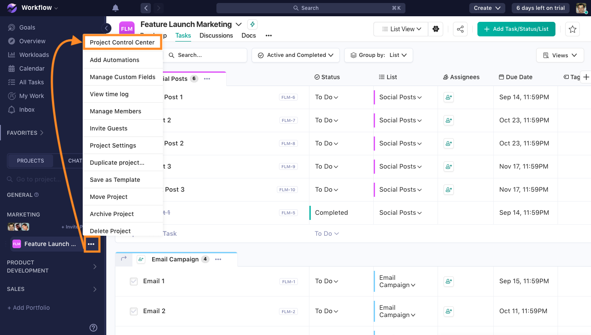
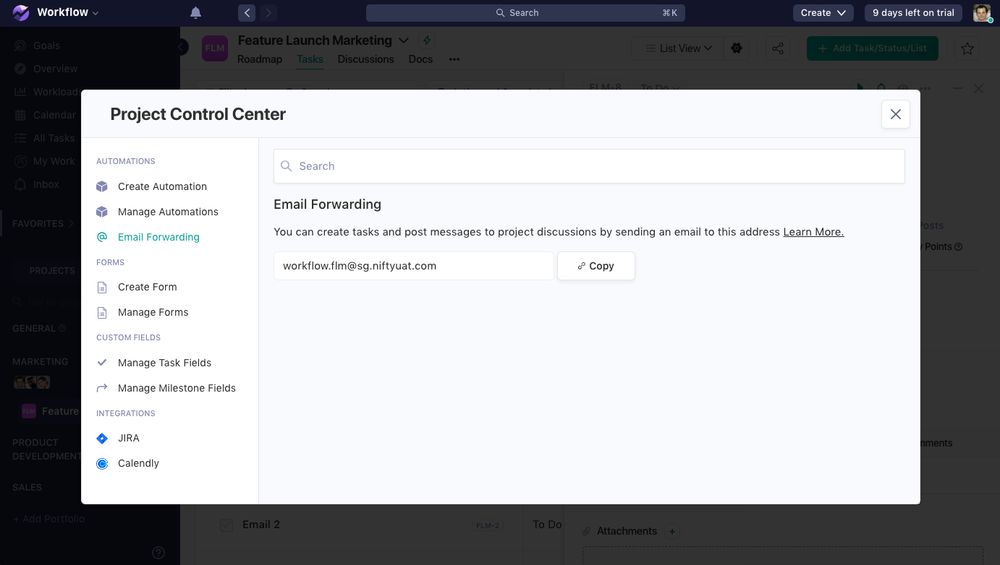

# niftycli

Create [Nifty](https://niftypm.com) tasks by email, from your terminal — no browser needed.

## Setup

```bash
npm i -g niftycli
```

## Create a task

```bash
niftycli
```

Once set up, this asks for a project, task name, and optional description, then
emails Nifty to create the task.

## Manage projects

```bash
niftycli project add       # add another project
niftycli project list      # list saved projects
niftycli project edit      # rename / update a project's email
niftycli project remove    # remove a project
```

You can also add a project on the fly from `niftycli` → **+ Add new project**.

## Commands

| Command                | Does                               |
| ---------------------- | ---------------------------------- |
| `niftycli`             | Setup (first run) or create a task |
| `niftycli init`        | (Re-)run setup                     |
| `niftycli new`         | Create a task                      |
| `niftycli project ...` | Manage projects (see above)        |
| `niftycli --help`      | List all commands                  |

### Finding your project's forwarding email

1. Open your Nifty project, click the **`...`** menu next to the project name in
   the sidebar, and select **Project Control Center**.

   

2. In the **Automations** section, click **Email Forwarding** and copy the
   address shown — this is the email you'll give `niftycli` for this project.

   

## Troubleshooting

- **SMTP connection fails** — double-check host/port/username/password. Gmail and
  Microsoft 365 usually need an "app password", not your normal login.
- **Task never arrives in Nifty** — check the project's forwarding email is correct. Duplicate tasks will be ignored by Nifty.
- **Ctrl+C** cancels any prompt cleanly.
